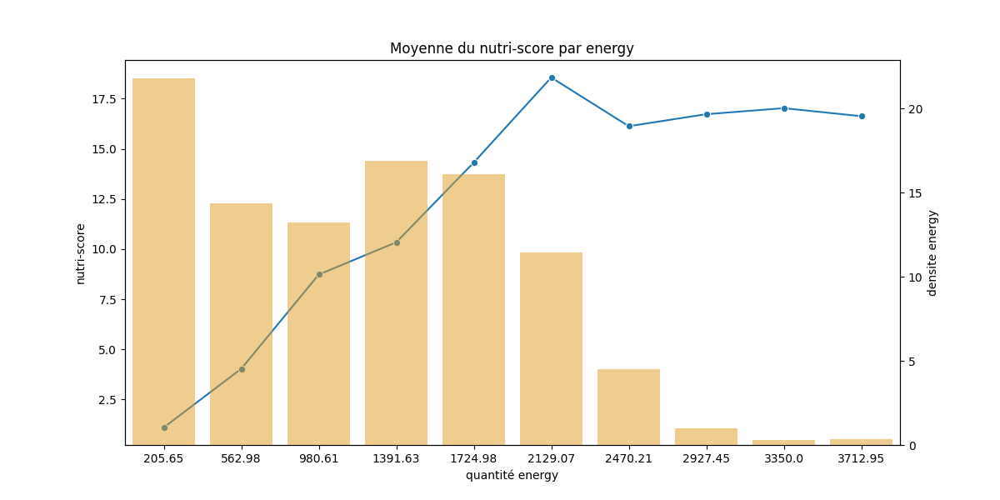
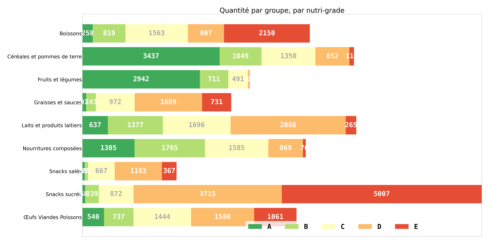

# Epicurism

Analyse des données sur le score des aliments.

Un notebook pour [le nettoyage des données](Clean_ðata.ipynb), un notebook pour [l’analyse des données](Analysis.ipynb).

Utilisation d’un script depuis le notebook pour générer des plots.

